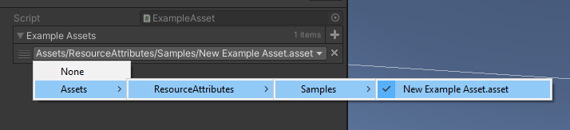
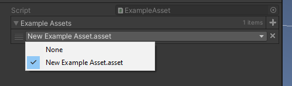

# Asset Attributes
#### Summary
Adds an attribute that can be placed on editor fields to display a dropdown selection for found assets. 

#### Disclaimer
While this is a super useful attribute, the performance is not great and something that needs to be performed. Avoid displaying many fields with this attribute at once.

## Usage
1. For any `UnityEngine.Object` field, apply the `AssetSelector` attribute
2. Provide a directory for the attribute to improve performance
3. In the Unity Editor, make a selection 

```csharp
public class MyBehaviour : MonoBehaviour 
{
    [AssetSelector(typeof(ExampleAsset), new string[] {"ResourceAttributes/Samples/"})] 
    public ExampleAsset[] exampleAssets; 
}
```
All assets found at the given path(s) will be listed as a selectable option. You can omit the path field in the attribute's constructor but this is not recommended. Doing so will search the entire asset database which is performance costly. 



With the "allow follders" disabled:



#### Notes
- You can disable the folder/pathing in the dropdown to just display the asset's name.
- You can pass `true` or `false` (or nothing) to determine whether or not a "None" option should appear in the dropdown. This will set the reference to `null` if selected.
- You can specify what file type to search for, the system by default will use `.asset`