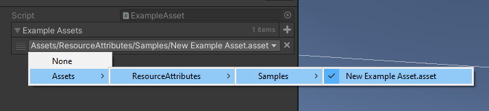

# Asset Attributes
Helpful Unity asset attributes for serialized fields.

## Usage
1. For any `UnityEngine.Object` field, apply the `AssetSelector` attribute
2. Provide a directory for the attribute to improve performance
3. In the Unity Editor, make a selection 

```csharp
public class MyBehaviour : MonoBehaviour 
{
    [AssetSelector(typeof(ExampleAsset), new string[] {"ResourceAttributes/Samples/"})] 
    public ExampleAsset[] exampleAssets; 
}
```
All assets found at the given path(s) will be listed as a selectable option. You can omit the path field in the attribute's constructor but this is not recommended. Doing so will search the entire asset database which is performance costly. 



#### Notes
- You can pass `true` or `false` (or nothing) to determine whether or not a "None" option should appear in the dropdown. This will set the reference to `null` if selected.
- You can specify what file type to search for, the system by default will use `.asset`